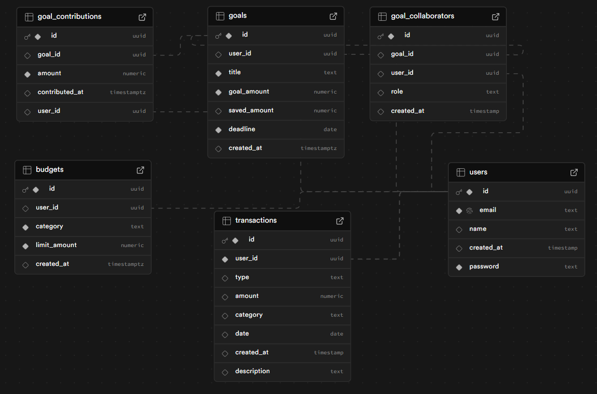

# SpendWise Backend

<p align="center">
  
</p>

<p align="center">
  <strong>Manage your finances intelligently with SpendWise Backend!</strong>
</p>

---

## 📝 Description

**SpendWise Backend** is a robust API developed in **Node.js** with **Supabase** as the database. It offers essential functionalities for personal financial management, including:

- **Secure user authentication**.
- **Financial transactions** (recording, editing, and deleting).
- **Expense analysis** with endpoints for financial insights.
- **Integrated chatbot** that answers questions about personal finances, helping users make more informed decisions.

This project was developed with a focus on scalability, security, and best development practices, using modern and efficient technologies.

---

## 🚀 Main Features

- **Secure Authentication**: Protecting user data with authentication via Supabase.
- **Transaction Management**: Recording, editing, and deleting financial transactions.
- **Expense Analysis**: Endpoints for viewing reports and financial insights.
- **Financial Chatbot**: Integration of a chatbot that assists users with questions about personal finances.

---

## 🛠️ Technologies Used

- **Node.js**: Runtime environment for backend development.
- **Express.js**: Framework for building the API.
- **Supabase**: PostgreSQL database with integrated authentication and storage.
- **PostgreSQL**: Relational database for data storage.
- **Dotenv**: Environment variable management.
- **Cors**: Middleware to allow requests from different origins.
- **Axios**: HTTP client for external integrations.

---

## 📋 Installation Steps

Follow the steps below to set up and run the project locally:

1. **Create a project on Supabase**:
   - Go to [Supabase](https://supabase.io), create an account, and start a new project.
   - In Supabase Studio, navigate to the **Tables** section and create the necessary tables according to the schema below:

   

2. **Clone the repository**:
   ```bash
   git clone "PROJECT_URL"
   cd spendwise-backend
   ```

3. **Configure the .env file**:

Create a .env file in the root of the project and add the following variables:
```bash
SUPABASE_URL=YOUR_SUPABASE_URL
SUPABASE_KEY=YOUR_SUPABASE_KEY
```
4. **Install dependencies** (requires Node.js installed):
 ```bash
   npm install
```

4. **Start the Server**:
```bash
node server.js
```

## 💡 Why this project?

SpendWise Backend was developed to demonstrate my skills in:

Developing scalable and secure APIs.

Integration with modern databases (Supabase/PostgreSQL).

Implementing complex functionalities, such as authentication and data analysis.

Using best development practices and modern tools.

## 📩 Contributions and Feedback

Contributions are welcome! If you have suggestions, improvements, or find any issues, feel free to open an issue or submit a pull request.

## 👨‍💻 Author
Developed by [Gabryel Willers](https://github.com/Gabryel-w). Let's connect and build something amazing!

<p align="center"> <strong>Transform your finances with SpendWise Backend! 💰🚀</strong> </p>